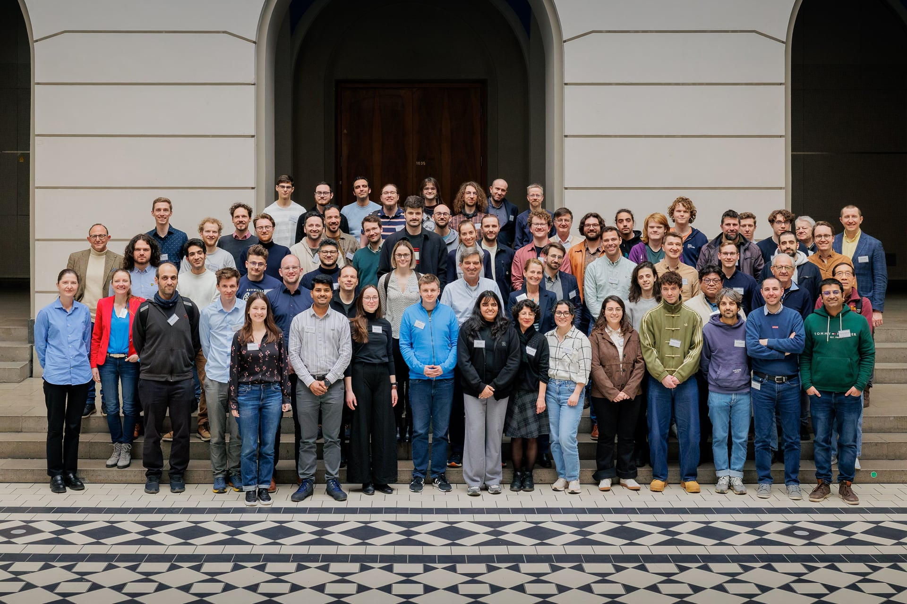
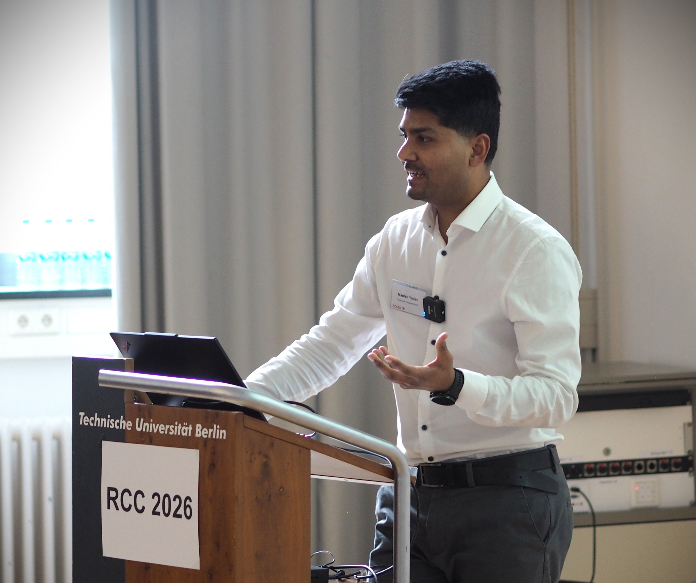
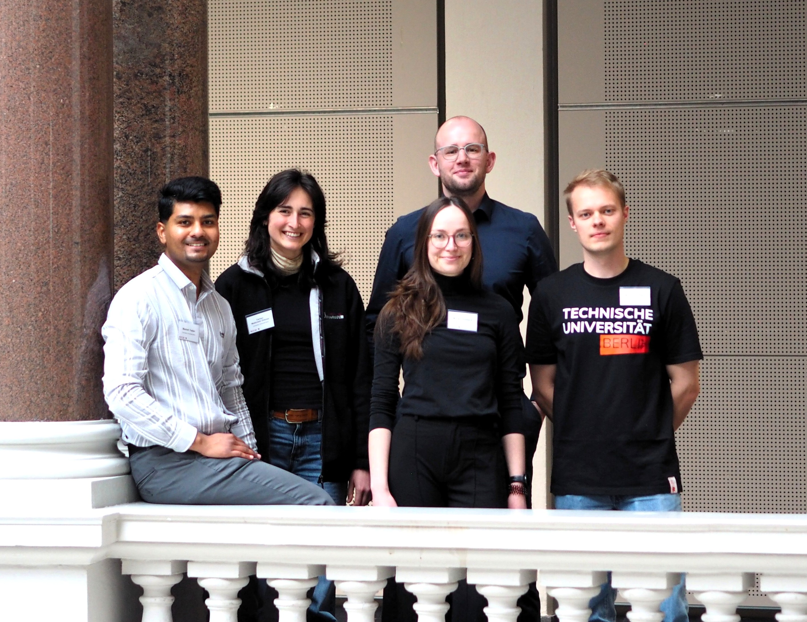
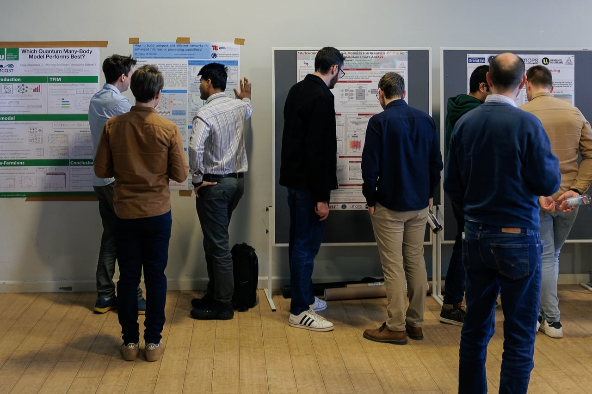
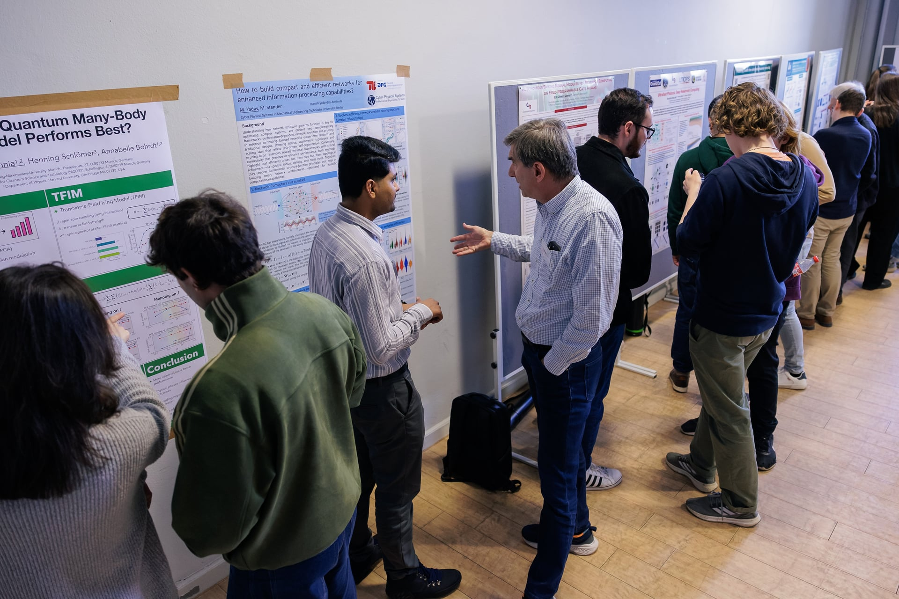

The **Reservoir Computing Conference 2026 (RCC26)** is an international conference dedicated to the field of reservoir computing and related machine learning approaches.

## RCC26 Attendees Group Photo

*Photo credit: Kevin Fuchs.*

## My Talk at RCC26

**Talk title:** "Understanding Structure-Function Relationships through PerformanceDependent Network Evolution"

## Local Organizing Team (CPS-ME, TU Berlin)

## Poster Presentation at RCC26

*Photo credit: Kevin Fuchs.*

## Co-organizing
I am co-organizing this conference together with [Prof. Merten Stender](/collaborators/merten-stender/) and the CPSME team at TU Berlin.

For more information, please visit the [official conference website](https://www.tu.berlin/en/cpsme/research/conferences/reservoir-computing-conference-rcc-2026).

## Conference Information

- **Location**: TU Berlin, Germany
- **Organizers**: Cyber-Physical Systems in Mechanical Engineering (CPSME) Department

## Topics

The conference covers a wide range of topics related to reservoir computing, including:

- Theoretical foundations of reservoir computing
- Novel reservoir architectures and designs
- Applications in time series prediction
- Physical reservoir computing
- Neuromorphic computing
- Structure-function relationships in reservoir networks
- Dynamics-informed machine learning

<!--more-->
